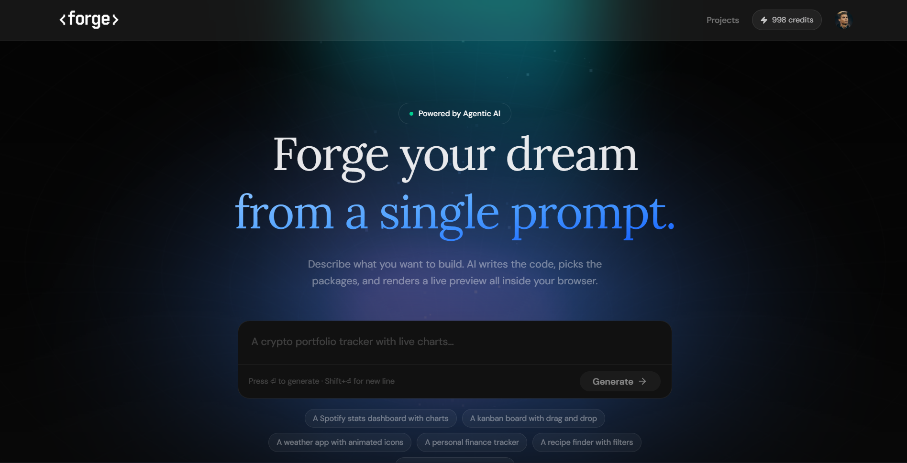

# Agentic App Builder 🚀

An AI-powered full-stack application builder that transforms natural language prompts into production-ready React applications with live preview, project persistence, autonomous AI improvements, and export functionality.

Built with Next.js, Gemini AI, Supabase, Prisma, Clerk Authentication, and Sandpack.



---

## Live Demo

https://agentic-app-builder-two.vercel.app/

---

## Overview

Agentic App Builder enables users to generate complete React applications simply by describing what they want to build.

The platform combines real-time AI code generation, live browser previews, project persistence, authentication, image uploads, and an autonomous AI agent capable of improving generated applications through iterative file-based modifications.

Inspired by modern AI development platforms such as Bolt.new, Lovable, and v0.

---

## Why I Built This

I wanted to explore how modern AI-powered development tools work under the hood.

This project demonstrates:

* Full-stack application architecture
* AI-powered code generation
* Streaming responses
* Agentic workflows
* Authentication and authorization
* Database persistence
* Real-time UI updates
* Production deployment workflows

The goal was to create a platform where users can generate, preview, improve, and export complete React applications using natural language prompts.

---

## Features

### AI App Generation

* Generate complete React applications from prompts
* Real-time AI streaming responses
* Structured code generation
* Dependency validation
* Automatic project naming

### Live Preview

* Powered by Sandpack
* Instant browser preview
* File explorer
* Code viewer
* Error detection

### AI Agent Improvements

* Improve existing applications using an autonomous AI agent
* File-by-file updates
* Live reasoning stream
* Automatic project refinement
* Real-time preview updates

### Authentication

* Clerk authentication
* Google OAuth login
* Protected routes
* User-specific projects

### Project Management

* Persistent workspace history
* Save generated projects
* Delete projects
* Resume previous sessions

### Image Upload Support

* Upload screenshots or references
* Store images in Supabase Storage
* AI-assisted visual prompting

### Credit System

* Free Plan: 10 Credits
* Starter Plan: 100 Credits
* Pro Plan: 1000 Credits
* Demo upgrade flow for recruiters
* Server-side validation

### Export Projects

* Export generated projects as ZIP files
* Ready-to-run React applications

### Modern UI

* Responsive design
* Dark mode interface
* Shadcn UI components
* Tailwind CSS styling
* Smooth animations

---

## Tech Stack

### Frontend

* Next.js 16
* React
* TypeScript
* Tailwind CSS
* Shadcn UI
* Framer Motion
* Sandpack

### Backend

* Next.js API Routes
* Prisma ORM
* PostgreSQL
* Supabase

### AI

* Gemini 2.5 Flash
* Cline SDK

### Authentication

* Clerk

### Infrastructure

* Supabase Storage
* Arcjet Rate Limiting
* Vercel Deployment

---

## Architecture

```text
User Prompt
      │
      ▼
Gemini AI Generation
      │
      ▼
Structured React Files
      │
      ▼
Sandpack Preview
      │
      ▼
Project Saved in Supabase
      │
      ▼
Optional AI Agent Improvements
```

---

## Getting Started

### Prerequisites

* Node.js 22+
* Supabase Account
* Clerk Account
* Google AI Studio API Key

### Installation

Clone the repository:

```bash
git clone https://github.com/YOUR_USERNAME/agentic-app-builder.git
cd agentic-app-builder
```

Install dependencies:

```bash
npm install
```

Generate Prisma Client:

```bash
npx prisma generate
```

Push schema:

```bash
npx prisma db push
```

Start development server:

```bash
npm run dev
```

Open:

```text
http://localhost:3000
```

---

## Environment Variables

Create a `.env.local` file:

```env
# Clerk
NEXT_PUBLIC_CLERK_PUBLISHABLE_KEY=
CLERK_SECRET_KEY=
NEXT_PUBLIC_CLERK_SIGN_IN_URL=/sign-in
NEXT_PUBLIC_CLERK_SIGN_UP_URL=/sign-up

# Supabase
NEXT_PUBLIC_SUPABASE_URL=
NEXT_PUBLIC_SUPABASE_ANON_KEY=

# Database
DATABASE_URL=

# Gemini
GEMINI_API_KEY=

# Arcjet
ARCJET_KEY=
```

---

## Database Schema

### User

```text
id
clerkId
name
email
imageUrl
credits
plan
createdAt
updatedAt
```

### Workspace

```text
id
userId
title
messages
fileData
createdAt
updatedAt
```

---

## Key Technical Challenges

### Streaming AI Responses

Implemented streaming responses from Gemini to provide a real-time user experience while generating code.

### Agentic File Updates

Built an autonomous AI workflow using Cline SDK that updates application files individually and streams progress back to the client.

### Sandpack Synchronization

Ensured code updates reflect instantly in the browser preview without unnecessary remounting.

### Credit Management

Implemented server-side credit validation and usage tracking for generation and improvement requests.

---

## Future Improvements

* Multi-framework support
* Team collaboration
* Project templates
* AI-generated backend APIs
* GitHub integration
* Deployment automation
* Version history
* Custom domains

---

## Screenshots

### Landing Page

Add screenshot here.

### Workspace

Add screenshot here.

### AI Agent

Add screenshot here.

### Projects Dashboard

Add screenshot here.

---

## Deployment

Frontend and API:

* Vercel

Database:

* Supabase

Authentication:

* Clerk

---

## Author

### Yashwardhan Soni

Full Stack Developer

GitHub:
https://github.com/yashsoni978

LinkedIn:
Add your LinkedIn profile here.

---

## License

This project is licensed under the MIT License.

---

## Support

If you found this project useful, consider giving it a ⭐ on GitHub.
